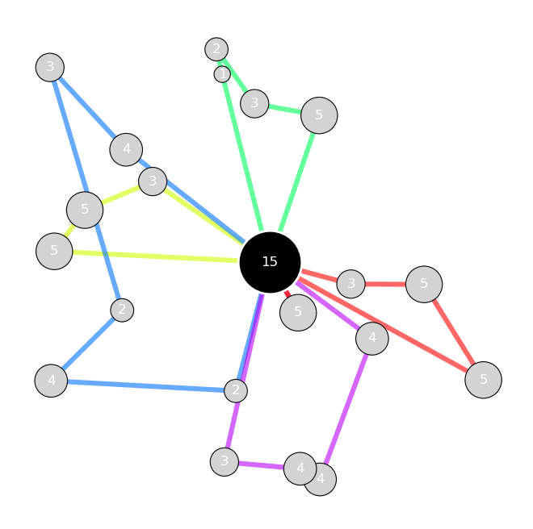
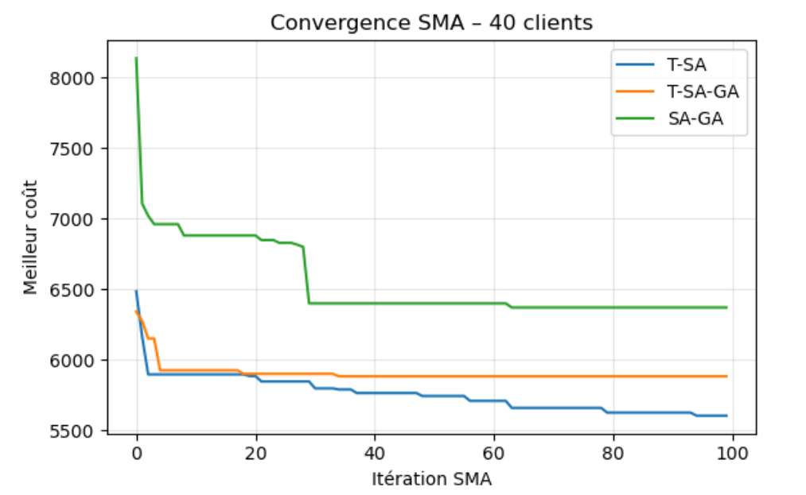
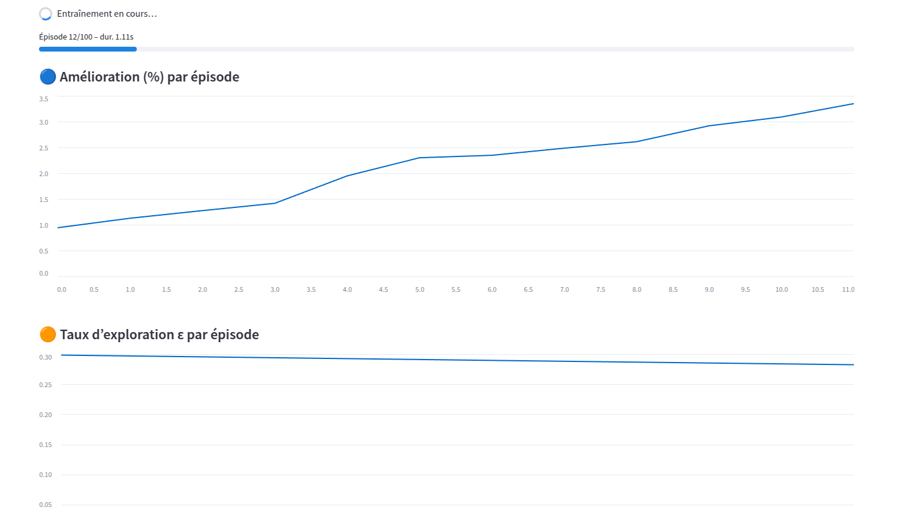

# Vehicle routing: metaheuristics, multi-agent systems and Q-Learning

The NP-hard vehicle routing problem (VRP), attacked three ways and benchmarked fairly: classic metaheuristics (tabu search, simulated annealing, genetic algorithm), a Top-N loop multi-agent system, and tabular Q-Learning with 2-opt operators. Group project (6 students), Collaborative Intelligence elective at Centrale Lille.



## Highlights

- **Shared, reproducible benchmark** with Optuna-tuned hyper-parameters for every algorithm, on 40 and 100 client instances.
- The multi-agent system reduces the initial pool cost by **7 to 26%** depending on agent combinations.
- **Winning strategy: simulated annealing then tabular Q-Learning (2-opt), about 13% better than the best standalone metaheuristic** on the 100-client instance (9,906 vs 11,493).
- Interactive Streamlit demo: live Q-Learning training, step-by-step solution verification, route maps.

## Gallery

| | |
|---|---|
|  |  |

## Report

The full report (French) is available on my [portfolio](https://ugo-roccamatisi.github.io).

## Run it

```bash
pip install -r requirements.txt
streamlit run app.py
```
